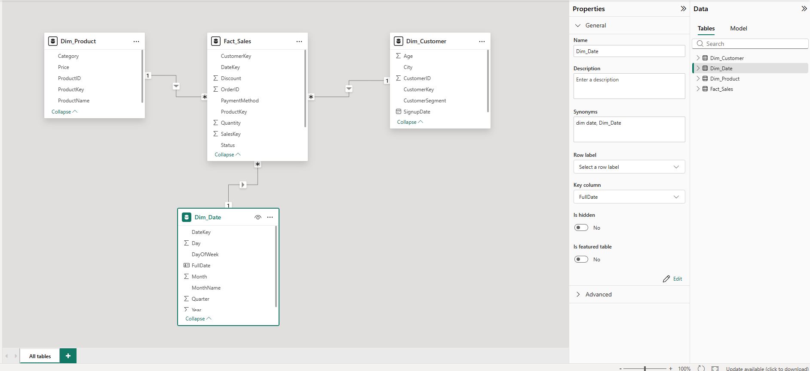
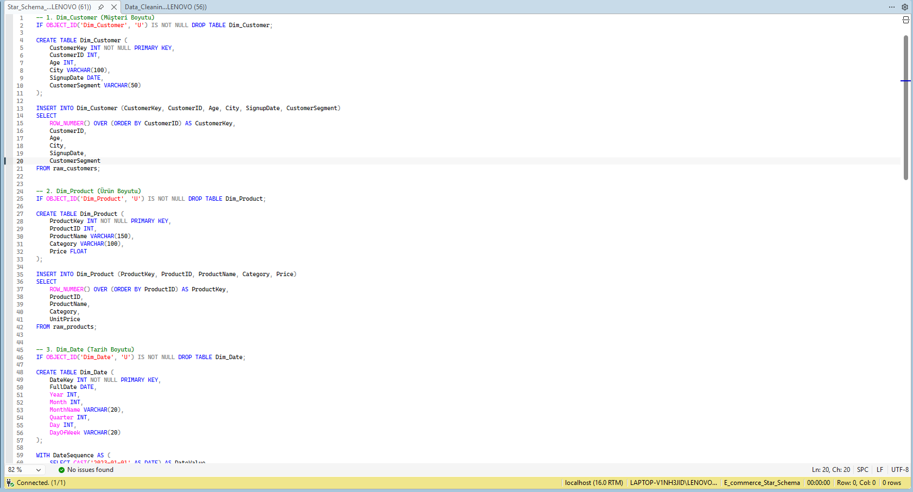
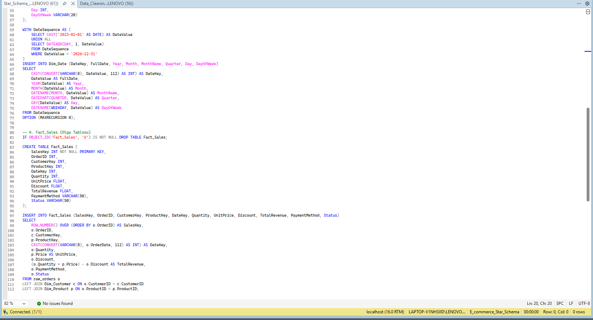
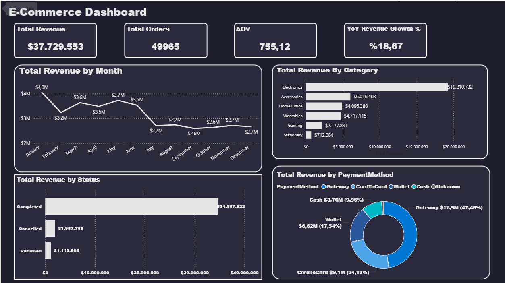
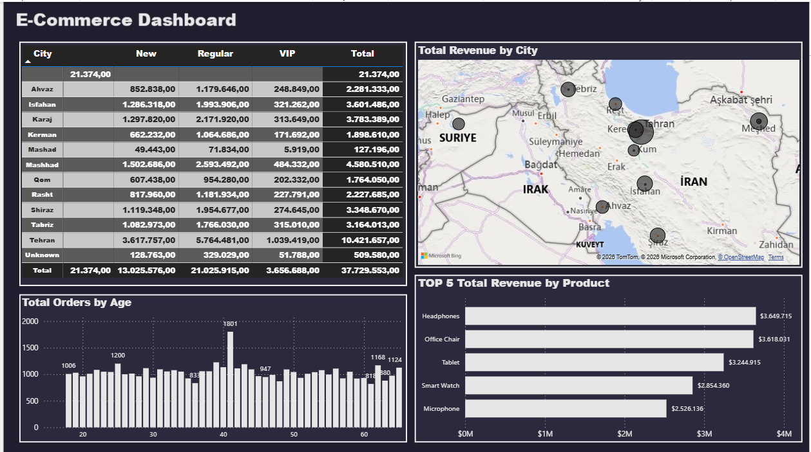

Markdown
# 🛒 E-Commerce Data Analytics & Power BI Dashboard

Bu proje, bir e-ticaret platformuna ait ham verilerin **T-SQL** kullanılarak modellenmesi (Data Warehousing / Data Architecture) ve **Power BI** ile etkileşimli, veri odaklı bir kararlaştırma paneline (Executive & Deep-Dive Dashboard) dönüştürülmesi sürecini kapsamaktadır.

---

## 📌 Proje Özeti

* **Veri Mimarisi:** T-SQL (MS SQL Server) üzerinde Yıldız Mimarisi (**Star Schema**) tasarlanmış; `Dim_Customer`, `Dim_Product`, `Dim_Date` boyut tabloları ve `Fact_Sales` olgu tablosu oluşturulmuştur.
* **İş Zekası & Görselleştirme:** Power BI Desktop kullanılarak dinamik DAX hesaplamaları yazılmış ve 2 sayfadan oluşan dark-theme tasarıma sahip dashboard geliştirilmiştir.

- 

---

## 🛠️ Kullanılan Teknolojiler

* **T-SQL / MS SQL Server:** ETL işlemleri, Veri Modelleme, Primary/Surrogate Key yönetimi, Özyinelemeli (Recursive CTE) tarih tablosu oluşturma.
* **Power BI Desktop:** Veri Modelleme (Relationships), DAX (Data Analysis Expressions), Dashboard Tasarımı & UX.
* **DAX:** KPI metrikleri, Zaman İçi Karşılaştırmalar (Time Intelligence - YoY).

---

## 📐 Veri Mimarisi & Yıldız Şeması (Star Schema)

Ham veriler SQL ortamında işlenerek ilişkisel veri omurgasına dönüştürülmüştür:

* **`Fact_Sales` (Olgu Tablosu):** `SalesKey` (PK), `OrderID`, `CustomerKey` (FK), `ProductKey` (FK), `DateKey` (FK), `Quantity`, `UnitPrice`, `Discount`, `TotalRevenue`, `PaymentMethod`, `Status`.
* **`Dim_Customer` (Müşteri Boyutu):** `CustomerKey` (PK), `CustomerID`, `Age`, `City`, `SignupDate`, `CustomerSegment`.
* **`Dim_Product` (Ürün Boyutu):** `ProductKey` (PK), `ProductID`, `ProductName`, `Category`, `Price`.
* **`Dim_Date` (Tarih Boyutu):** `DateKey` (PK), `FullDate`, `Year`, `Month`, `MonthName`, `Quarter`, `Day`, `DayOfWeek`. 

- 
 
- 

---

## 🧮 Kullanılan DAX Metrikleri (`_Measure`)

Dashboard üzerindeki tüm analizler dinamik DAX ölçüleri ile beslenmektedir:

* **`Total Revenue`** = `SUM(Fact_Sales[TotalRevenue])`
* **`Total Orders`** = `DISTINCTCOUNT(Fact_Sales[OrderID])`
* **`Total Quantity Sold`** = `SUM(Fact_Sales[Quantity])`
* **`Total Discount`** = `SUM(Fact_Sales[Discount])`
* **`AOV` (Average Order Value)** = `DIVIDE([Total Revenue], [Total Orders], 0)`
* **`PY Revenue` (Prior Year Revenue)** = `CALCULATE([Total Revenue], SAMEPERIODLASTYEAR(Dim_Date[FullDate]))`
* **`YoY Revenue Growth %`** = `DIVIDE([Total Revenue] - [PY Revenue], [PY Revenue], 0)`

- 
  
---

## 📊 Dashboard Yapısı ve Görseller

 Dashboard 2 ana sayfadan oluşmaktadır:

### 1. Executive Overview (Yönetici Özet Paneli)
* **KPI Kartları:** Total Revenue ($37.7M), Total Orders (49,965), AOV ($755.12), YoY Revenue Growth (%18.67).
* **Total Revenue by Month:** Aylık ciro trendi.
* **Total Revenue by Category:** Kategorilere göre satış dağılımı (Electronics başı çekiyor).
* **Total Revenue by Status:** Tamamlanan, iptal edilen ve iade edilen siparişlerin ciro karşılığı.
* **Total Revenue by PaymentMethod:** Ödeme yöntemlerinin payı (Gateway %47.45 ile ilk sırada).

- 

### 2. Customer & Product Deep-Dive (Müşteri & Ürün Detay Analizi)
* **Matrix Tablosu:** Şehir ve Müşteri Segmentine (`New`, `Regular`, `VIP`) göre ciro dağılımı.
* **Total Revenue by City (Map Visual):** Harita üzerinde bölgesal satış yoğunluğu.
* **Total Orders by Age:** Yaş kırılımına göre sipariş adetleri.
* **TOP 5 Total Revenue by Product:** En çok ciro getiren ilk 5 ürün (Headphones, Office Chair, Tablet, Smart Watch, Microphone).

- 

---

## 📬 İletişim
Bu proje ile ilgili sorularınız veya önerileriniz için benimle [LinkedIn profilim](https://www.linkedin.com/in/deniz-bal-64838b225) üzerinden iletişime geçebilirsiniz.
